# phdenzel's dotfiles

This is my collection of configuration files for a UNIX-based
operating system; a backup of settings, of sorts. In particular, it
features configurations for Emacs, zsh (and/or bash), XMonad (xorg),
and Hyprland (wayland).

Usually, these **dotfiles** are placed in the home folder (when
possible in `XDG_CONFIG_HOME=~/.config/`) where the corresponding
program looks for them, and overwrites potentially unwanted default
settings. So be careful when installing!  
I started this repo for macOS in order to make it feel more like Linux
(back when *macOS Sierra 10.12.2* and *macOS High Sierra 10.13.1* were
the latest versions). These days however, I'm back on Linux (*Arch*
and *Pop!_OS*). I am currently (slowly) working on conditionals to
automatically make everything completely compatible from the 'git-go',
so to speak... but for now all user-specifics have to be manually
modified in `USERINFO` and copied into `~/.config/USERINFO`.

The repository can be cloned wherever you want; a natural place would
be `~/dotfiles`, i.e. the home folder.

**Warning**: Use with caution! Check the files first before
installing; especially all scripts in `installers/`.  The files in
`etc/` and `utils/` are probably no use to anyone except me, but I
included them anyways, just in case somebody wants to change them for
their own use.

### Example
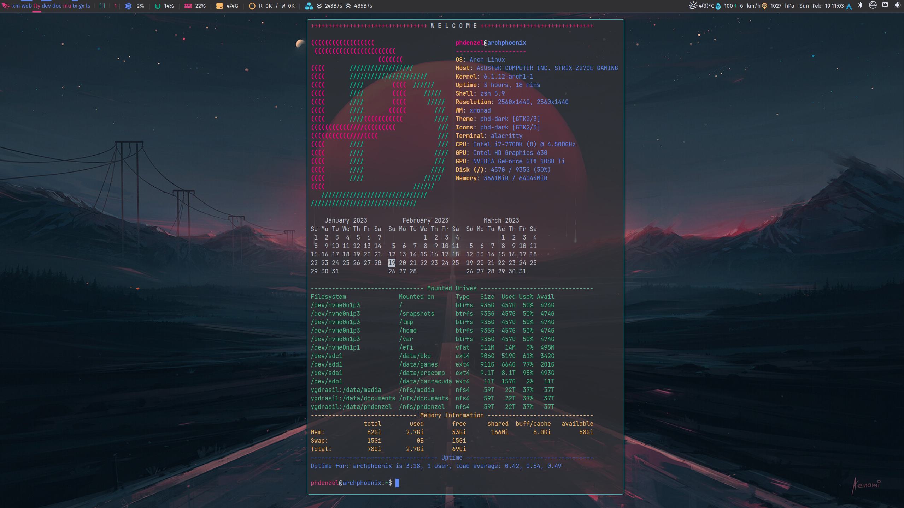
  
### Install

For full functionality, make sure you have `zsh` installed. E.g. on Arch linux

```bash
sudo pacman -S zsh
chsh -s /bin/zsh
```

To install the dotfiles simply run:

```bash
./bootstrap.sh
```
while in `dotfiles` (use `bootstrap.sh -h` to see all options).

```
  Usage: bootstrap.sh [-c|--conf PATH] [-l|--bin-path PATH]
                      [-n|--dry-run] [-d|--diff] [-s|--skip]
                      [-b|--bin] [-e|--emacs] [-t|--themes]
                      [-x|--xmonad] [-w|--hypr]
                      [--source]

         Bootstrap script for installing the phdenzel/dotfiles using rsync.

         -h, --help         Prints this message.
         -c, --conf <path>  Sets the path where the configuration will be
                            installed. Default: $HOME/.config
         -l, --bin-path     Sets the path where the binaries will be installed,
                            resp. symlinked. Default: $HOME/local/bin
         -n, --dry-run      Runs all rsync commands in dry-run mode.
         -d, --diff         Shows all diffs between the already existing and
                            to-be-installed configurations;
                            only takes effect with the -n, --diff flag.
         -s, --skip         Skips installing all main dotfiles (when used with
                            e.g. -x, the script installs only the xmonad
                            configurations).
         -b, --bin          Installs/symlinks binaries from $HOME/dotfiles/bin
         -e, --emacs        Installs emacs configurations.
         -t, --themes       Installs the custom 'phd-dark' theme
                            (GTK, QT, highlight, etc.)
         -x, --xmonad       Installs xmonad configurations.
         -w, --hypr         Installs hyprland configurations.
         --source           Source the installed bash/zsh configuration.
```


### Shell scripts:
Moreover, the repository holds several shell scripts, although they
aren't strictly speaking dotfiles. Nevertheless, it's quite useful to
be able to clone a single repository onto a new machine and run only a
handful of commands that install all your scripts, settings and
libraries at once.  *Again, go through the files first and make sure
you know what they aare doing, before installing*.

* `arch.sh` - installs my most frequently used arch packages from the
  official and AUR repositories (use `arch.sh -h` for details)
* `arch_iso.sh` - downloads the latest iso of the arch installer
* `arch-install.org` - is a guide how to cleanly install a recent
  versions of arch
* `arch-setup.org` - is a guide of how I set up and configure arch
  from a clean install
* `arch_vm.sh` - initializes an arch VM using kvm/qemu
* `raspian.sh` - describes how I set up my RaspberryPi machines
* `macos.sh` - describes how I set up my macOS machines/vms
* `iso_macos*.sh` - describes how to convert macOS installers into
  isos
  
### Themes

The dotfiles also provide several flavors of my own 'phd-ark' theme
for various programs such as `emacs`, `alacritty`, `bat`, etc., as
well as for the GTK and QT frameworks.

<table>
    <th colspan="3" align="center"><h4>Color palettes of the phd-ark flavors</h4></th>
    <tr>
        <th><h5>iridis</h5></th>
        <th><h5>dark</h5></th>
        <th><h5>light</h5></th>
    </tr>
    <tr>
        <td><table>
            <tr>
                <th>Name</th>
                <th>Colors</th>
                <th>Codes</th>
            </tr>
            <tr>
                <td>magenta</td>
                <td align="center">
                    
                </td>
                <td><code>#FF0087</code></td>
            </tr>
            <tr>
                <td>pink</td>
                <td align="center">
                    
                </td>
                <td><code>#E83A82</code></td>
            </tr>
            <tr>
                <td>ruby</td>
                <td align="center">
                    
                </td>
                <td><code>#D7005F</code></td>
            </tr>
            <tr>
                <td>crimson</td>
                <td align="center">
                    
                </td>
                <td><code>#D70000</code></td>
            </tr>
            <tr>
                <td>red</td>
                <td align="center">
                    
                </td>
                <td><code>#FF6D6B</code></td>
            </tr>
            <tr>
                <td>tiger</td>
                <td align="center">
                    
                </td>
                <td><code>#FF5F00</code></td>
            </tr>
            <tr>
                <td>orange</td>
                <td align="center">
                    
                </td>
                <td><code>#F69927</code></td>
            </tr>
            <tr>
                <td>sand</td>
                <td align="center">
                    
                </td>
                <td><code>#FDB760</code></td>
            </tr>
            <tr>
                <td>yellow</td>
                <td align="center">
                    
                </td>
                <td><code>#FFD787</code></td>
            </tr>
            <tr>
                <td>green</td>
                <td align="center">
                    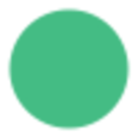
                </td>
                <td><code>#44BC84</code></td>
            </tr>
            <tr>
                <td>grass</td>
                <td align="center">
                    
                </td>
                <td><code>#3DAA77</code></td>
            </tr>
            <tr>
                <td>emerald</td>
                <td align="center">
                    
                </td>
                <td><code>#00AF5F</code></td>
            </tr>
            <tr>
                <td>viridis</td>
                <td align="center">
                    
                </td>
                <td><code>#00AF87</code></td>
            </tr>
            <tr>
                <td>teal</td>
                <td align="center">
                    
                </td>
                <td><code>#4DB5BD</code></td>
            </tr>
            <tr>
                <td>ocean</td>
                <td align="center">
                    
                </td>
                <td><code>#1F5582</code></td>
            </tr>
            <tr>
                <td>turquoise</td>
                <td align="center">
                    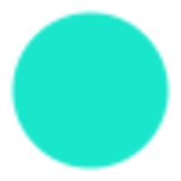
                </td>
                <td><code>#1AE6CC</code></td>
            </tr>
            <tr>
                <td>cyan</td>
                <td align="center">
                    
                </td>
                <td><code>#46D9FF</code></td>
            </tr>
            <tr>
                <td>blue</td>
                <td align="center">
                    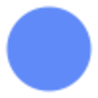
                </td>
                <td><code>#5F8AF7</code></td>
            </tr>
            <tr>
                <td>indigo</td>
                <td align="center">
                    
                </td>
                <td><code>#5F5FFF</code></td>
            </tr>
            <tr>
                <td>amethyst</td>
                <td align="center">
                    
                </td>
                <td><code>#3723B7</code></td>
            </tr>
            <tr>
                <td>lilac</td>
                <td align="center">
                    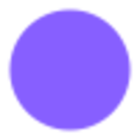
                </td>
                <td><code>#875FFF</code></td>
            </tr>
            <tr>
                <td>purple</td>
                <td align="center">
                    
                </td>
                <td><code>#8787FF</code></td>
            </tr>
            <tr>
                <td>violet</td>
                <td align="center">
                    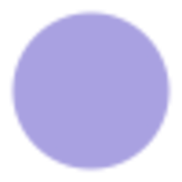
                </td>
                <td><code>#A9A1E1</code></td>
            </tr>
            <tr>
                <td>white</td>
                <td align="center">
                    
                </td>
                <td><code>#F6F9FE</code></td>
            </tr>
            <tr>
                <td>subtext0</td>
                <td align="center">
                    
                </td>
                <td><code>#EDF3FE</code></td>
            </tr>
            <tr>
                <td>subtext1</td>
                <td align="center">
                    
                </td>
                <td><code>#DDE3EE</code></td>
            </tr>
            <tr>
                <td>text</td>
                <td align="center">
                    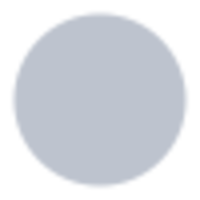
                </td>
                <td><code>#BDC3CE</code></td>
            </tr>
            <tr>
                <td>overlay2</td>
                <td align="center">
                    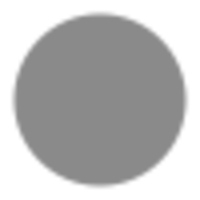
                </td>
                <td><code>#8A8A8A</code></td>
            </tr>
            <tr>
                <td>overlay1</td>
                <td align="center">
                    
                </td>
                <td><code>#464858</code></td>
            </tr>
            <tr>
                <td>overlay0</td>
                <td align="center">
                    
                </td>
                <td><code>#5B6268</code></td>
            </tr>
            <tr>
                <td>surface2</td>
                <td align="center">
                    
                </td>
                <td><code>#515C66</code></td>
            </tr>
            <tr>
                <td>surface1</td>
                <td align="center">
                    
                </td>
                <td><code>#404850</code></td>
            </tr>
            <tr>
                <td>surface0</td>
                <td align="center">
                    
                </td>
                <td><code>#3A3C3F</code></td>
            </tr>
            <tr>
                <td>base</td>
                <td align="center">
                    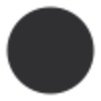
                </td>
                <td><code>#303033</code></td>
            </tr>
            <tr>
                <td>mantle</td>
                <td align="center">
                    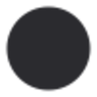
                </td>
                <td><code>#2B2B2F</code></td>
            </tr>
            <tr>
                <td>crust</td>
                <td align="center">
                    
                </td>
                <td><code>#181E26</code></td>
            </tr>
        </table></td>
        <td><table>
            <tr>
                <th>Name</th>
                <th>Colors</th>
                <th>Codes</th>
            </tr>
            <tr>
                <td>magenta</td>
                <td align="center">
                    
                </td>
                <td><code>#FF0087</code></td>
            </tr>
            <tr>
                <td>pink</td>
                <td align="center">
                    
                </td>
                <td><code>#E83A82</code></td>
            </tr>
            <tr>
                <td>ruby</td>
                <td align="center">
                    
                </td>
                <td><code>#D7005F</code></td>
            </tr>
            <tr>
                <td>crimson</td>
                <td align="center">
                    
                </td>
                <td><code>#D70000</code></td>
            </tr>
            <tr>
                <td>red</td>
                <td align="center">
                    
                </td>
                <td><code>#FF6D6B</code></td>
            </tr>
            <tr>
                <td>tiger</td>
                <td align="center">
                    
                </td>
                <td><code>#FF5F00</code></td>
            </tr>
            <tr>
                <td>orange</td>
                <td align="center">
                    
                </td>
                <td><code>#F69927</code></td>
            </tr>
            <tr>
                <td>sand</td>
                <td align="center">
                    
                </td>
                <td><code>#FDB760</code></td>
            </tr>
            <tr>
                <td>yellow</td>
                <td align="center">
                    
                </td>
                <td><code>#FFD787</code></td>
            </tr>
            <tr>
                <td>green</td>
                <td align="center">
                    
                </td>
                <td><code>#44BC84</code></td>
            </tr>
            <tr>
                <td>grass</td>
                <td align="center">
                    
                </td>
                <td><code>#3DAA77</code></td>
            </tr>
            <tr>
                <td>emerald</td>
                <td align="center">
                    
                </td>
                <td><code>#00AF5F</code></td>
            </tr>
            <tr>
                <td>viridis</td>
                <td align="center">
                    
                </td>
                <td><code>#00AF87</code></td>
            </tr>
            <tr>
                <td>teal</td>
                <td align="center">
                    
                </td>
                <td><code>#4DB5BD</code></td>
            </tr>
            <tr>
                <td>ocean</td>
                <td align="center">
                    
                </td>
                <td><code>#1F5582</code></td>
            </tr>
            <tr>
                <td>turquoise</td>
                <td align="center">
                    
                </td>
                <td><code>#1AE6CC</code></td>
            </tr>
            <tr>
                <td>cyan</td>
                <td align="center">
                    
                </td>
                <td><code>#46D9FF</code></td>
            </tr>
            <tr>
                <td>blue</td>
                <td align="center">
                    
                </td>
                <td><code>#5F8AF7</code></td>
            </tr>
            <tr>
                <td>indigo</td>
                <td align="center">
                    
                </td>
                <td><code>#5F5FFF</code></td>
            </tr>
            <tr>
                <td>amethyst</td>
                <td align="center">
                    
                </td>
                <td><code>#3723B7</code></td>
            </tr>
            <tr>
                <td>lilac</td>
                <td align="center">
                    
                </td>
                <td><code>#875FFF</code></td>
            </tr>
            <tr>
                <td>purple</td>
                <td align="center">
                    
                </td>
                <td><code>#8787FF</code></td>
            </tr>
            <tr>
                <td>violet</td>
                <td align="center">
                    
                </td>
                <td><code>#A9A1E1</code></td>
            </tr>
            <tr>
                <td>white</td>
                <td align="center">
                    
                </td>
                <td><code>#F6F9FE</code></td>
            </tr>
            <tr>
                <td>subtext0</td>
                <td align="center">
                    
                </td>
                <td><code>#EDF3FE</code></td>
            </tr>
            <tr>
                <td>subtext1</td>
                <td align="center">
                    
                </td>
                <td><code>#DDE3EE</code></td>
            </tr>
            <tr>
                <td>text</td>
                <td align="center">
                    
                </td>
                <td><code>#BDC3CE</code></td>
            </tr>
            <tr>
                <td>overlay2</td>
                <td align="center">
                    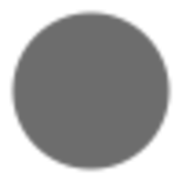
                </td>
                <td><code>#6D6D6D</code></td>
            </tr>
            <tr>
                <td>overlay1</td>
                <td align="center">
                    
                </td>
                <td><code>#353642</code></td>
            </tr>
            <tr>
                <td>overlay0</td>
                <td align="center">
                    
                </td>
                <td><code>#494E53</code></td>
            </tr>
            <tr>
                <td>surface2</td>
                <td align="center">
                    
                </td>
                <td><code>#404850</code></td>
            </tr>
            <tr>
                <td>surface1</td>
                <td align="center">
                    
                </td>
                <td><code>#2E353A</code></td>
            </tr>
            <tr>
                <td>surface0</td>
                <td align="center">
                    
                </td>
                <td><code>#27292B</code></td>
            </tr>
            <tr>
                <td>base</td>
                <td align="center">
                    
                </td>
                <td><code>#1D1D1F</code></td>
            </tr>
            <tr>
                <td>mantle</td>
                <td align="center">
                    
                </td>
                <td><code>#18181B</code></td>
            </tr>
            <tr>
                <td>crust</td>
                <td align="center">
                    
                </td>
                <td><code>#090B0E</code></td>
            </tr>
        </table></td>
        <td><table>
            <tr>
                <th>Name</th>
                <th>Colors</th>
                <th>Codes</th>
            </tr>
            <tr>
                <td>magenta</td>
                <td align="center">
                    
                </td>
                <td><code>#FF0087</code></td>
            </tr>
            <tr>
                <td>pink</td>
                <td align="center">
                    
                </td>
                <td><code>#E83A82</code></td>
            </tr>
            <tr>
                <td>ruby</td>
                <td align="center">
                    
                </td>
                <td><code>#D7005F</code></td>
            </tr>
            <tr>
                <td>crimson</td>
                <td align="center">
                    
                </td>
                <td><code>#D70000</code></td>
            </tr>
            <tr>
                <td>red</td>
                <td align="center">
                    
                </td>
                <td><code>#FF6D6B</code></td>
            </tr>
            <tr>
                <td>tiger</td>
                <td align="center">
                    
                </td>
                <td><code>#FF5F00</code></td>
            </tr>
            <tr>
                <td>orange</td>
                <td align="center">
                    
                </td>
                <td><code>#F69927</code></td>
            </tr>
            <tr>
                <td>sand</td>
                <td align="center">
                    
                </td>
                <td><code>#FDB760</code></td>
            </tr>
            <tr>
                <td>yellow</td>
                <td align="center">
                    
                </td>
                <td><code>#FFD787</code></td>
            </tr>
            <tr>
                <td>green</td>
                <td align="center">
                    
                </td>
                <td><code>#44BC84</code></td>
            </tr>
            <tr>
                <td>grass</td>
                <td align="center">
                    
                </td>
                <td><code>#3DAA77</code></td>
            </tr>
            <tr>
                <td>emerald</td>
                <td align="center">
                    
                </td>
                <td><code>#00AF5F</code></td>
            </tr>
            <tr>
                <td>viridis</td>
                <td align="center">
                    
                </td>
                <td><code>#00AF87</code></td>
            </tr>
            <tr>
                <td>teal</td>
                <td align="center">
                    
                </td>
                <td><code>#4DB5BD</code></td>
            </tr>
            <tr>
                <td>ocean</td>
                <td align="center">
                    
                </td>
                <td><code>#1F5582</code></td>
            </tr>
            <tr>
                <td>turquoise</td>
                <td align="center">
                    
                </td>
                <td><code>#1AE6CC</code></td>
            </tr>
            <tr>
                <td>cyan</td>
                <td align="center">
                    
                </td>
                <td><code>#46D9FF</code></td>
            </tr>
            <tr>
                <td>blue</td>
                <td align="center">
                    
                </td>
                <td><code>#5F8AF7</code></td>
            </tr>
            <tr>
                <td>indigo</td>
                <td align="center">
                    
                </td>
                <td><code>#5F5FFF</code></td>
            </tr>
            <tr>
                <td>amethyst</td>
                <td align="center">
                    
                </td>
                <td><code>#3723B7</code></td>
            </tr>
            <tr>
                <td>lilac</td>
                <td align="center">
                    
                </td>
                <td><code>#875FFF</code></td>
            </tr>
            <tr>
                <td>purple</td>
                <td align="center">
                    
                </td>
                <td><code>#8787FF</code></td>
            </tr>
            <tr>
                <td>violet</td>
                <td align="center">
                    
                </td>
                <td><code>#A9A1E1</code></td>
            </tr>
            <tr>
                <td>white</td>
                <td align="center">
                    
                </td>
                <td><code>#F6F9FE</code></td>
            </tr>
            <tr>
                <td>subtext0</td>
                <td align="center">
                    
                </td>
                <td><code>#303033</code></td>
            </tr>
            <tr>
                <td>subtext1</td>
                <td align="center">
                    
                </td>
                <td><code>#2B2B2F</code></td>
            </tr>
            <tr>
                <td>text</td>
                <td align="center">
                    
                </td>
                <td><code>#181E26</code></td>
            </tr>
            <tr>
                <td>overlay2</td>
                <td align="center">
                    
                </td>
                <td><code>#5B6268</code></td>
            </tr>
            <tr>
                <td>overlay1</td>
                <td align="center">
                    
                </td>
                <td><code>#464858</code></td>
            </tr>
            <tr>
                <td>overlay0</td>
                <td align="center">
                    
                </td>
                <td><code>#8A8A8A</code></td>
            </tr>
            <tr>
                <td>surface2</td>
                <td align="center">
                    
                </td>
                <td><code>#3A3C3F</code></td>
            </tr>
            <tr>
                <td>surface1</td>
                <td align="center">
                    
                </td>
                <td><code>#404850</code></td>
            </tr>
            <tr>
                <td>surface0</td>
                <td align="center">
                    
                </td>
                <td><code>#515C66</code></td>
            </tr>
            <tr>
                <td>base</td>
                <td align="center">
                    
                </td>
                <td><code>#EDF3FE</code></td>
            </tr>
            <tr>
                <td>mantle</td>
                <td align="center">
                    
                </td>
                <td><code>#DDE3EE</code></td>
            </tr>
            <tr>
                <td>crust</td>
                <td align="center">
                    
                </td>
                <td><code>#BDC3CE</code></td>
            </tr>
        </table></td>
    </tr>
</table>


### More
[Mathias Bynens](https://github.com/mathiasbynens/dotfiles) has another great dotfile setup which was highly influencial to mine.
