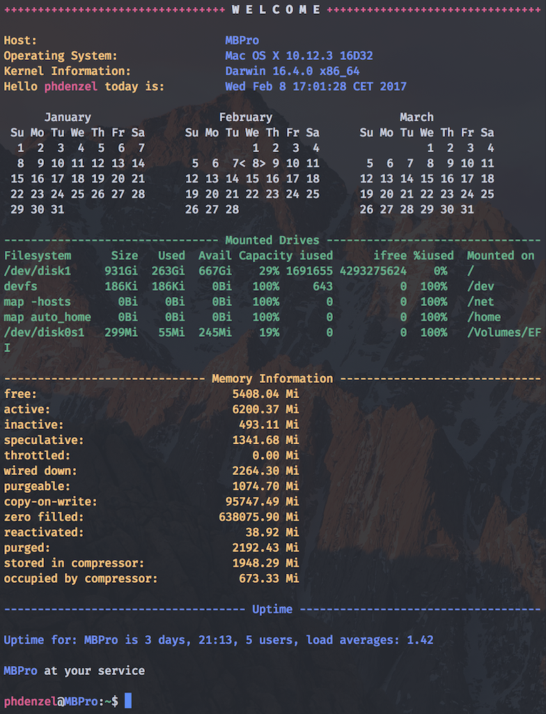

# phdenzel's dotfiles

This is my collection of configuration files for a UNIX-based operating system; a backup of settings, of sorts.
  
Usually, these **dotfiles** are placed in the home folder where the according program looks for them, and overwrites potentially unwanted default settings. So be careful when installing!  
Some of the files are especially designed for macOS (tested on *macOS Sierra 10.12.2*), however there are Linux/GNU-based variants in comments to most of the commands that can be used instead (tested on *Red Hat Linux Server kernel-2.6.32-573.22.1.el6.x86_64*). I am currently (slowly) working on conditionals to automatically make other OS'es completely compatible from the 'git-go', so to speak...
  
The repository can be cloned wherever you want; a natural place would be `~/dotfiles`, i.e. the home folder, or to use a *symlink* from the clone to the home folder (that's what I do).

**Warning**: Use with caution! Check the files first before installing; especially `macOS`, `brew.sh`, `pip.sh`, `gem.sh`, and `git_clone.sh`.

### Example

  
### Install

To install the dotfiles simply type:

```bash
source bootstrap.sh
```
while in `dotfiles`.

Alternatively, you can run:

```bash
source bootstrap.sh --emacs
```

which installs an emacs configuration: `.emacs.d` to the `$HOME` folder,   
or

```bash
source bootstrap.sh --terminal
```

which installs:

* a terminal theme: `phd.terminal` to `~/Documents/`
* a custom-shortcut for macOS: `Launch\ Terminal.workflow` to `~/Library/Services/`

of course, these Terminal configurations are macOS-specific.
 
### Bash scripts:
Moreover, the repository holds several bash scripts, although they aren't strictly speaking dotfiles. Nevertheless, it's quite useful to be able to clone a single repository onto a new machine and run only a handful of commands that install all your settings and libraries at once.
*Again, go through the files first and make sure you know what they are doing, before installing*.

* `./macOS` - changes macOS-specific settings (only for macOS users)
* `bash brew.sh` - downloads useful Homebrew packages (takes up quite a bit of disk space)
* `bash pip.sh` - installs essential python libraries
* `bash gem.sh` - installs a couple of ruby gems
* `bash git-clone.sh` - creates a `~/git-clones` directory and clones useful git repositories into it.
* `bash db2Documents.sh` - creates symlinks from `~/Dropbox` to `~/Documents` (fill the lists in the loops with your own directories or files)
* `bash db2Home.sh` - creates symlinks from `~/Dropbox` to `~/` (fill the lists in the loops with your own directories or files)

### More
[Mathias Bynens](https://github.com/mathiasbynens/dotfiles) has another great dotfile setup which was highly influencial to mine.
